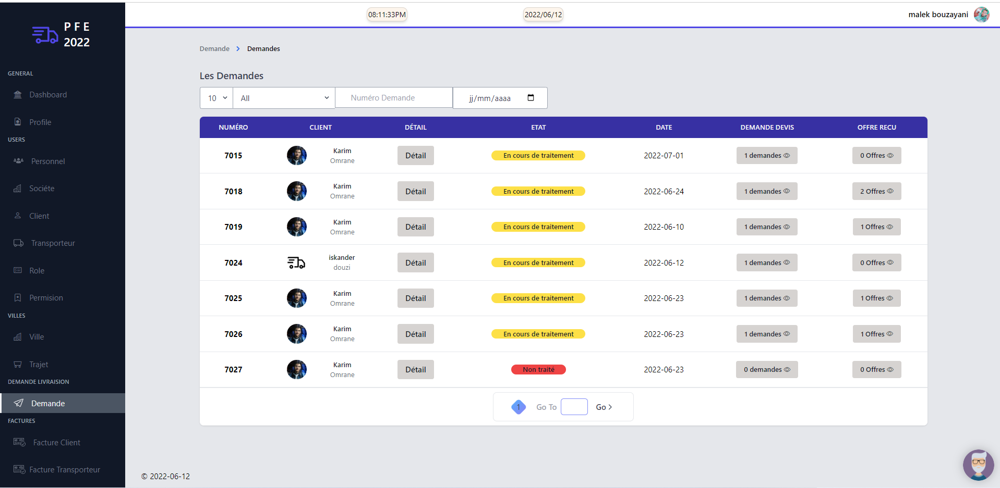

# PFE BOUZAYANI Malek 
 Encadrer par Ms.Rabii MEJAI 
 "Flexi Logistics"
 Développement et conception d'une application pour le logistique et de transport au sein de la sociéte TunVita

# BASE DE DONNEE : SQL SERVER 
# WEB API  : ASP.NET CORE 
# FRONT WEB : VUE JS  
# MOBILE : IONIC + VUE JS 

# Interface WEB

# Interface MOBILE

